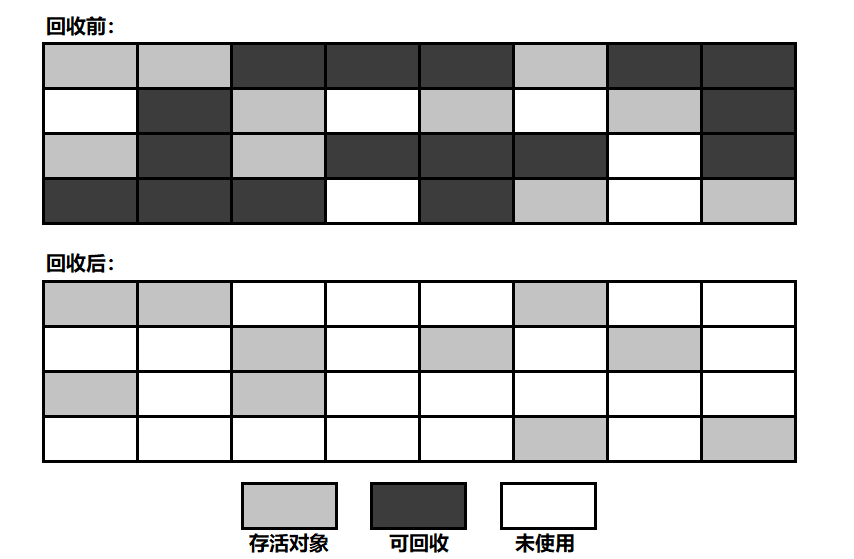

# 垃圾收集(GC)

垃圾收集(Garbage Collection, GC)，它的任务是解决以下 3 个问题:

- 哪些内存需要回收？
- 什么时候回收?
- 如何回收?

在 Java 中，GC 主要发生在 Java 堆和方法区中

## 判断对象的生死

### 判断对象是否可回收的算法

#### 引用计数法

- **算法描述**:
    - 给对象添加一个引用计数器
    - 每有一个地方引用它，计数器加 1
    - 引用失效时，计数器减 1
    - 计数器值为 0 的对象可被回收
- **缺点**:
    - 很难解决循环引用的问题: 即 objA.instance = objB; objB.instance = objA;，objA 和 objB 都不会再被访问
    后，它们仍然相互引用着对方，所以它们的引用计数器不为 0，将永远不能被判为不可用

#### 可达性分析算法(主流)

- **算法描述**
    - 从 **GC Root** 对象作为起点开始向下搜索，走过的路径称为引用链(Reference Chain)
    - 从 **GC Root** 开始，不在引用链上的对象可被回收
- **Java 中可作为 GC Root 的对象**
    - 栈中(本地变量表中的 reference)
        - 虚拟机栈中，栈帧中的本地变量表引用的对象
        - 本地方法栈中，JNI 引用的对象(native 方法)
    - 方法区中
        - 类的静态属性引用的对象
        - 常量引用的对象
        
即便如此，一个对象也不是被判为不可达就立即死去的，宣告一个对象的死亡需要经过两次标记过程

### 四种引用类型

JDK 1.2 后，Java 才有了后 3 种引用的实现

- **强引用**: 像 `Object obj = new Object()` 这种，只有强引用还存在，垃圾收集器就永远不会回收掉被引用的对象
- **软引用**: 用来引用还存在但非必须但对象。对于软引用对象，在 OOM 前，虚拟机会把这些对象列入回收范围中进行第二次回
收，如果这次回收后内存还是不够用，就 OOM。实现类: `SoftReference`
- **弱引用**: 被弱引用引用的对象只能生存到下一次垃圾收集前，一旦发生垃圾收集，被弱引用引用的对象就会被回收掉。实现类: 
`WeakReference`
- **虚引用**: 幽灵引用，对对象没有半毛钱影响，甚至不能用来取得一个对象的实例。它唯一的用途就是：当被一个虚引用引用的
对象被回收时，系统会收到这个对象被回收了的通知。实现类: `PhantomReference`

### 宣告对象死亡的两次标记过程

- 当发现对象不可达后，该对象被第一次标记，并进行是否有必要执行 `finalize()` 方法对判断:
    - 无需执行: 对象没有覆盖 `finalize()` 方法，或者 `finalize()` 方法已被执行过(`finalize()` 只被执行一次)
    - 需要执行: 将该对象放置到销毁队列，稍后由一个虚拟机自动创建的低优先级线程执行销毁
- `finalize()` 方法是对象逃脱死亡的最后一次机会，不过虚拟机不保证等待 `finalize()` 方法执行结束，也就是说，虚拟机
只触发 `finalize()` 方法的执行，如果这个方法要执行很长时间，那么虚拟机并不会等待它执行结束，所以最好不要用这个方法
- `finalize()` 能做的，`try-finally` 都能做，所以忘了这个方法吧

### 方法区的回收

永久代的 GC 主要回收: **废弃常量** 和 **无用的类**

- 废弃常量: 例如一个字符串 "abc"，当没有任何引用指向 "abc" 时，它就是废弃常量了
- 无用的类: 同时满足以下 3 个条件的类
    - 该类的所有实例已被回收，Java 堆中不存在该类的任何实例
    - 加载该类的 Classloader 已被回收
    - 该类的 Class 对象没有被任何地方引用，即无法在任何地方通过反射访问该类的方法
    
## 垃圾收集算法

### 标记-清除算法

基础实现

- **算法描述**
    - 先标记出所有需要回收的对象(图中深色区域)
    - 标记完成后，统一回收所有被标记的对象(留下碎片化的可用内存区域)
- **不足**:
    - 效率问题: 标记和清理两个过程的效率都不高
    - 空间碎片问题: 标记清除后会产生大量不连续的内存碎片，导致以后为较大的对象分配内存时找不到足够的连续内存，会提前触
    发另一次 GC

### 复制算法

解决效率问题，但会占用额外内存，适合用于对象大批量死亡的新生代

- **算法描述**
    - 将可用内存分为大小相对的两块，每次只使用其中一块
    - 当一块内存用完时，将这块内存上还存活的对象复制到另一块内存上清，将这一块内存全部清理掉
- **不足**: 可用内存缩为原来的一半，很浪费内存，适合 GC 过后只有少量内存存活的新生代
- **节省内存的方法**
    - 新生代中的对象 98% 都是朝生夕死的，所以不需要按照 1:1 的比例对内存进行划分
    - 把内存划分为:
        - 1 块较大的 Eden 区
        - 2 块较小的 Survivor 区
    - 每次使用 Eden 区和 1 块 Survivor 区
    - 回收时，将以上 2 部分区域中存活对象复制到另一块 Survivor 区中，然后将以上两部分区域清空
    - 如果 Survivor 区内存不够存放本次 GC 后 Eden 区存活的对象时，这些对象将会直接进入老年代
    - JVM 参数设置: `-XX:SurvivoRatio=8` 表示 Survivor 区的内存大小是 Eden 区的八分之一

### 标记-整理算法

解决空间碎片问题，不会占用额外内存，但是存在效率问题，适合用与死亡对象较少的老年代

- **算法描述**
    - 标记方法与 **标记-清除算法** 一样
    - 标记完成后，将所有存活对象向一端移动，然后直接清除掉边界以外的内存
- **不足**: 存在效率问题，适合老年代

### 分代收集算法

1. 弱分代假说(Weak Generational Hypothesis): 绝大多数对象都是朝生夕死的
2. 强分代假说(Strong Generational Hypothesis): 熬过越多次垃圾收集过程的对象就难以消亡

- **新生代**: GC 过后只有少量对象存活 — **复制算法**
- **老年代**: GC 过后对象存活率高 — **标记整理算法**